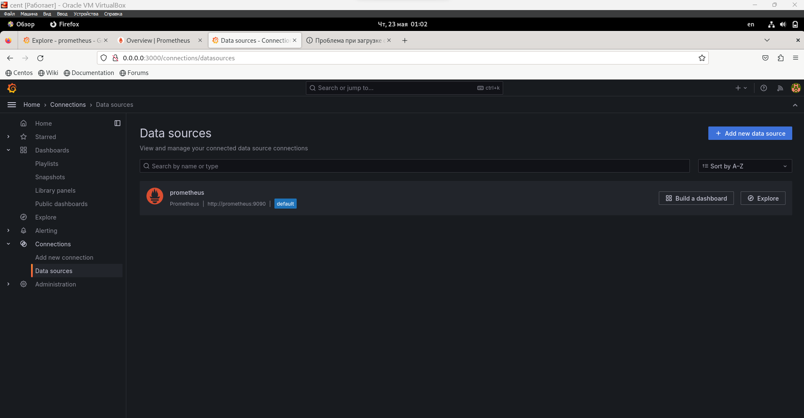

# monitoring-03-grafana
Домашнее задание к занятию 14 «Средство визуализации Grafana»
#
Задание 1
#

#
Задание 2

100 - avg(irate(node_cpu_seconds_total{job="node-exporter", mode="idle"}[1m])) * 100
#

#
avg(node_load1{job="node-exporter"})

avg(node_load5{job="node-exporter"})

avg(node_load15{job="node-exporter"})
#

#
node_memory_MemFree_bytes
#
node_memory_MemTotal_bytes
#

#
node_filesystem_avail_bytes
#

#
общее
#

Задание 3
#

#
Задание 4
#
[text](1.json)
#